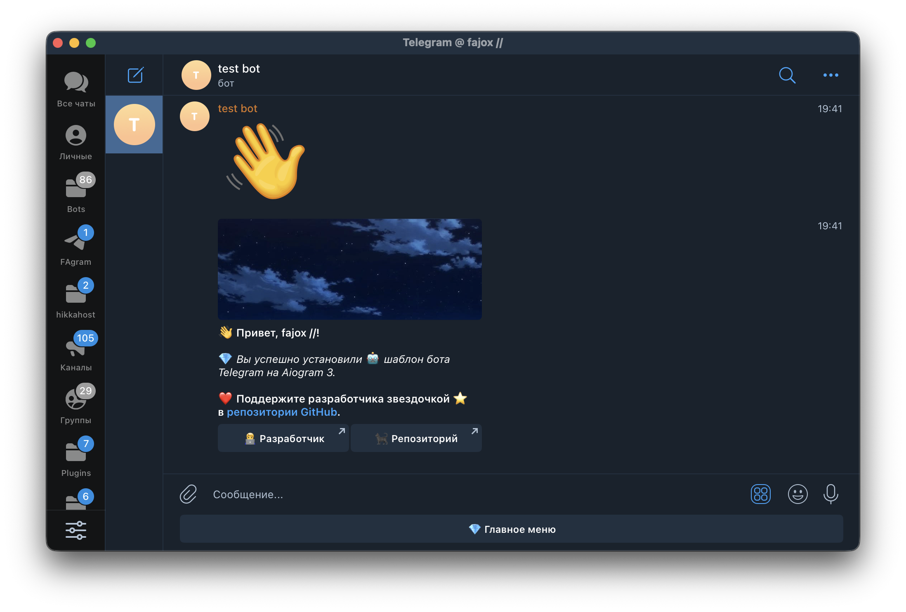

<div align="center">

<h1>🤖 Telegram bot template for Aiogram 3.x</h1>

*The best option for a Telegram bot structure on Aiogram 3.x.*

</div>



## 🔥 Features:
- 🌐 **Smart AI translation** - Built-in intelligent translation support for multi-language bot interactions
- 🏗️ **Modern structure** - Clean, maintainable project architecture following best practices
- ⚡ **Latest Aiogram** - Uses the newest Aiogram 3.x framework for robust telegram bot development
- 🐍 **Python 3.14** - Powered by the latest Python 3.14 runtime for optimal performance
- 💬 **Aiogram dialog library** - Integrated dialog system for complex conversation flows
- ⚙️ **Easy configuration and startup** - Simple setup with environment variables and one-command launch

## ⬇️ Installation

> 💡 Require **🐍 Python 3.14**

### 🐳 Install Docker

- Ubuntu/Debian
```sh
sudo apt update
sudo apt install docker.io -y
```
- Windows or MacOS [here](https://www.docker.com/products/docker-desktop/).

### 🤖 Create your own Telegram API Server

- Get your API ID and API HASH <a href="https://api.telegram.org">here</a>.

<b>Or use the default ones:</b><br>
api_id: <code>2040</code><br>
api_hash: <code>b18441a1ff607e10a989891a5462e627</code>

> 💡 Make sure the port is **only** working on the `localhost`.
```sh
docker run -d \
  -p 8081:8081 \
  --name telegram-bot-api \
  --restart always \
  -v telegram-bot-api-data:/var/lib/telegram-bot-api \
  -e TELEGRAM_API_ID=your_api_id \
  -e TELEGRAM_API_HASH=your_api_hash \
  aiogram/telegram-bot-api:latest
```

### 🐈‍⬛ Clone repository
```sh
git clone https://github.com/fajox1/tgbotbase-aiogram3
cd tgbotbase-aiogram3
```

### 🗂 Configure environment variables
> 📁 Rename `example.env` to `.env`

* Get your variables and put them into the config.

### 📚 Libraries

#### 💈 UV installation

- On MacOS and Linux.
```sh
curl -LsSf https://astral.sh/uv/install.sh | sh
```

- On Windows
```powershell
powershell -ExecutionPolicy ByPass -c "irm https://astral.sh/uv/install.ps1 | iex"
```

- Via pip
```sh
pip install uv
```
```
uv init
uv sync
```

### 🔥 Start it
```sh
uv run -m src
```

<i>Licensed under GPL GNU 3.0<br>
Developer: <a href="https://t.me/fajox">@fajox</a></i>